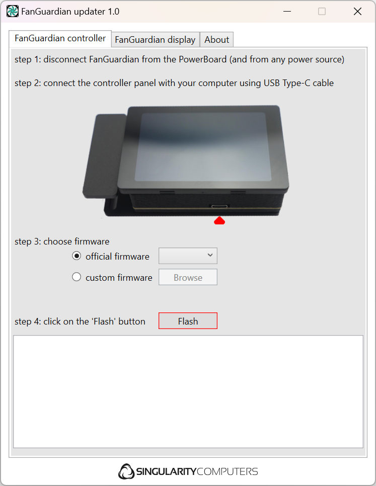

# FanGuardian Updater
The FanGuardian Updater is a software designed to change the firmware on _FanGuardian Controller_ and _FanGuardian Display_.

  

This program uses BOSSA and esptool cli third-party binary to flash _FanGuardian Controller_ and _FanGuardian Display_, respectively.
BOSSA is released under the terms of the BSD license as specified [here](https://raw.githubusercontent.com/shumatech/BOSSA/refs/heads/master/LICENSE).
See the source code at https://gihthub.com/shumatech/BOSSA. While esptool is released under the terms of the [GNU license](https://github.com/espressif/esptool/blob/master/LICENSE) and it is available at https://github.com/espressif/esptool.

# Flashing the firmware

## On the FanGuardian Controller
1. Disconnect FanGuardian from the PowerBoard and from any power source.
2. Connect the controller panel to your computer using USB Type-C cable.
3. Choose the official firmware from the drop-down menu, or select a custom firmware from a folder.
4. Click on "Flash".

## On the FanGuardian Display
1. Disconnect FanGuardian from the PowerBoard and from any power source.
2. Connect the display panel to your computer using USB Type-C cable.
3. Choose the official firmware from the drop-down menu, or select a custom firmware from a folder.
4. Click on "Flash".

The progress of the update process will be displayed at the bottom of the window.

# Contributing
All contributions and feedback are warmly welcomed.

# Licensing
This project is licensed under the GNU GPLv3 License - see the LICENSE file for details. The GNU GPLv3 lets you to do almost anything you want with your project, except distributing closed source versions.

